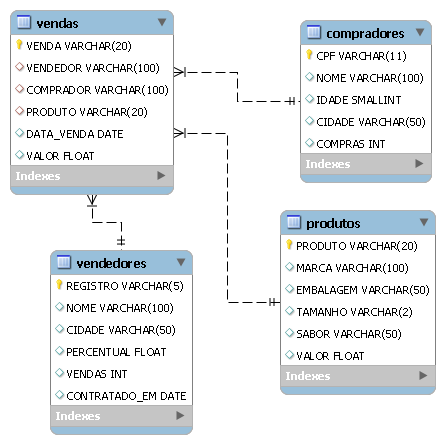

# Estudos SQL

Este repositório serve como demonstração dos meus conhecimentos sobre `SQL`, adquiridos durante estudos sobre o mesmo. Todos os códigos e consultas são de minha autoria. Eles podem ser usados como referência, mas não compõem nenhum projeto. Fique à vontade para explorar os códigos, mas caso queira executar, será necessário usar um `SGBD`, recomendo o `MySQL`.

## Conteúdo

*DER do banco de dados usado como referência aos estudos*

- **[Documento 01:](Documentos/Documento_01.sql)** Criação do banco de dados através do `CREATE DATABASE`.
- **[Documento 02:](Documentos/Documento_02.sql)** Criação das tabelas do banco de dados através do `CREATE TABLE`.
- **[Documento 03:](Documentos/Documento_03.sql)** Seleção das chaves primárias e estrangeiras através do `ALTER TABLE`.
- **[Documento 04:](Documentos/Documento_04.sql)** Inserção dos dados através do `INSERT INTO`.
- **[Documento 05:](Documentos/Documento_05.sql)** Alteração e remoção de registros através de `UPDATE` e `DELETE`.
- **[Documento 06:](Documentos/Documento_06.sql)** Adição de colunas através do `ALTER TABLE`.
- **[Documento 07:](Documentos/Documento_07.sql)** Consultas `SELECT` segregando os registros através de `LIMIT` e `AS`.
- **[Documento 08:](Documentos/Documento_08.sql)** `SELECT` segregando os registros através do `WHERE`.
- **[Documento 09:](Documentos/Documento_09.sql)** Consultas `SELECT` segregando os registros através de operadores relacionais.
- **[Documento 10:](Documentos/Documento_10.sql)** `SELECT` através de operadores relacionais e funções `DAY`.
- **[Documento 11:](Documentos/Documento_11.sql)** Consultas `SELECT` segregando os registros através de `AND`, `OR` e `NOT`.
- **[Documento 12:](Documentos/Documento_12.sql)** `SELECT` segregando os registros através do `LIKE`.
- **[Documento 13:](Documentos/Documento_13.sql)** Consultas `SELECT` segregando os registros através do `DISTINCT`.
- **[Documento 14:](Documentos/Documento_14.sql)** `SELECT` ordenando os registros através do `ORDER BY`.
- **[Documento 15:](Documentos/Documento_15.sql)** Consultas `SELECT` agrupando os registros através do `GROUP BY`.
- **[Documento 16:](Documentos/Documento_16.sql)** `SELECT` usando `GROUP BY` segregando os registros através do `HAVING`.
- **[Documento 17:](Documentos/Documento_17.sql)** Consultas `SELECT` classificando os registros através do `CASE`.
- **[Documento 18:](Documentos/Documento_18.sql)** Junção de tabelas através de `INNER JOIN`, `RIGHT JOIN` e `LEFT JOIN`.
- **[Documento 19:](Documentos/Documento_19.sql)** Junção de consultas `SELECT` através de `UNION` e `UNION ALL`.
- **[Documento 20:](Documentos/Documento_20.sql)** `SELECT` explorando o conceito de `SUBCONSULTAS`.
- **[Documento 21:](Documentos/Documento_21.sql)** Remoção das tabelas do banco de dados através do `DROP TABLE`.
- **[Documento 22:](Documentos/Documento_22.sql)** Remoção do banco de dados através do `DROP DATABASE`.